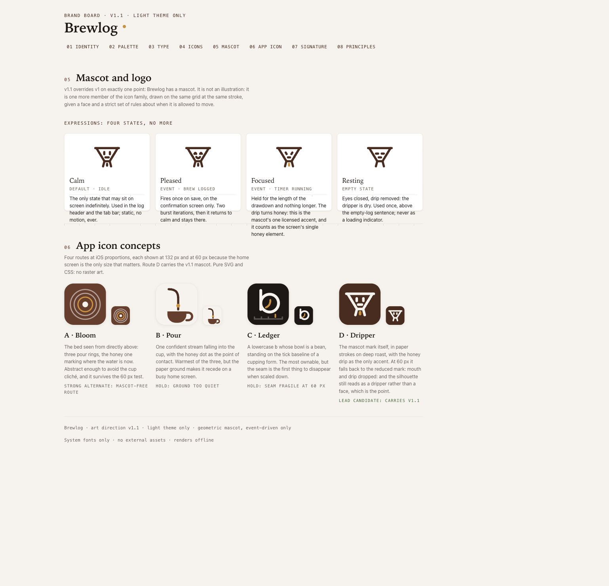
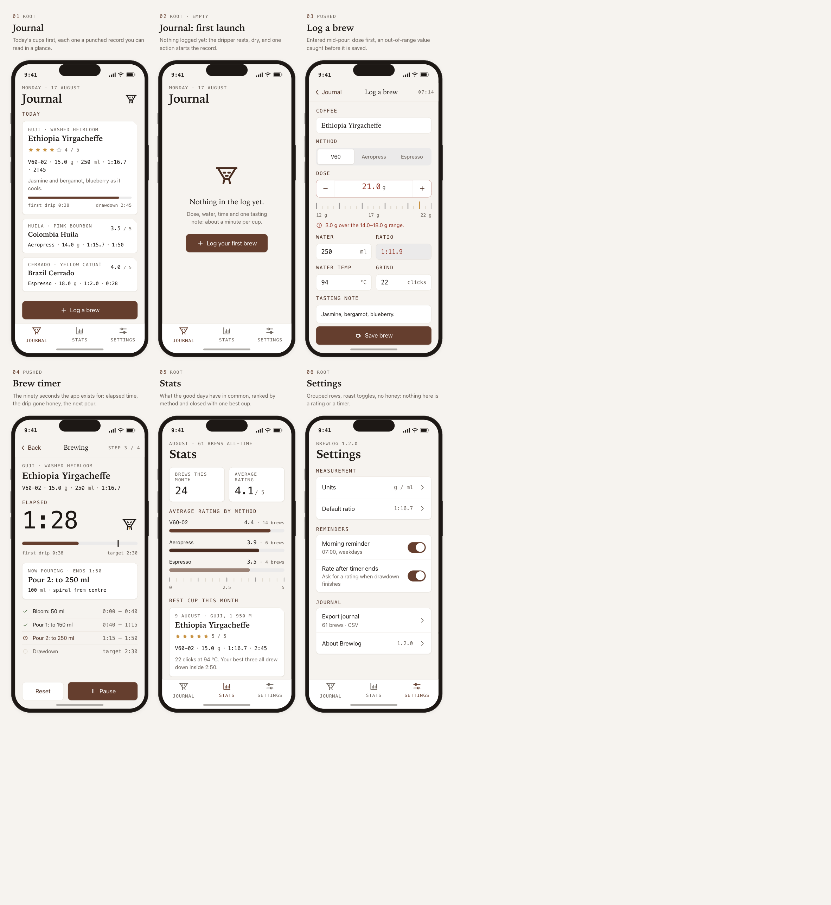
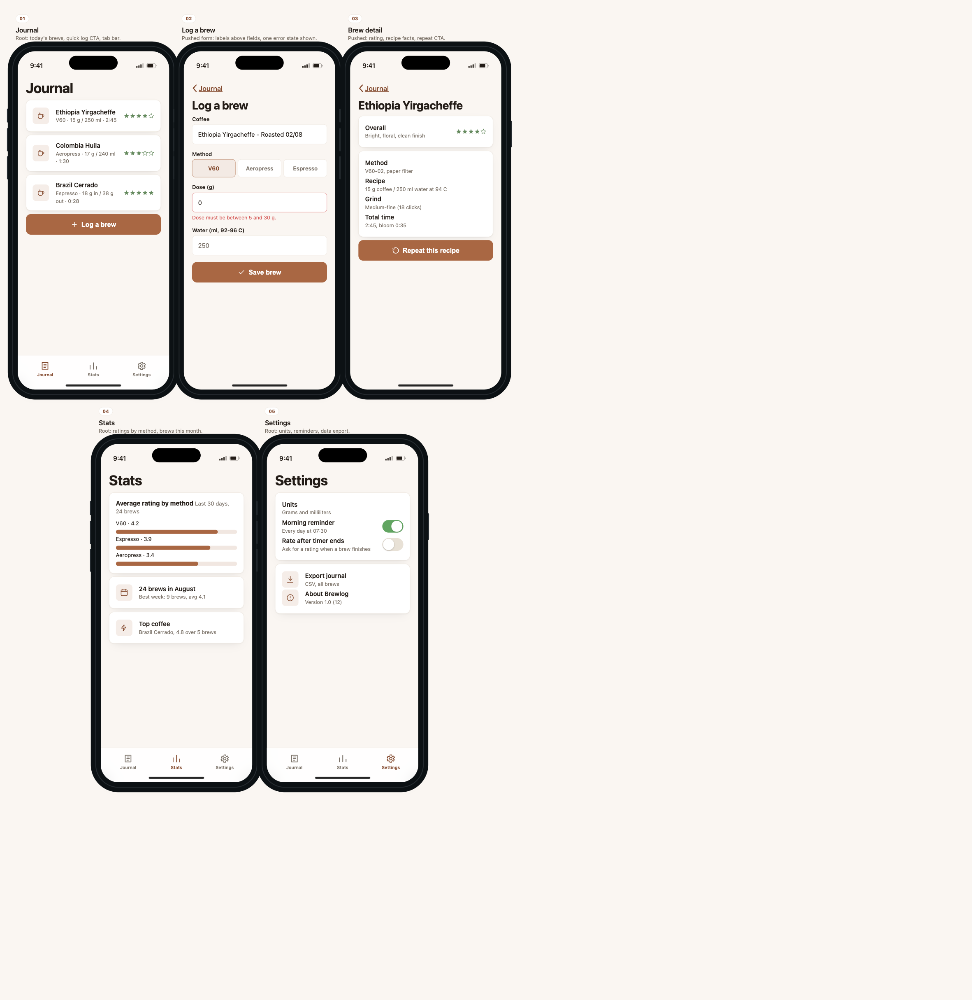

# app-design-skills

Two composable [Agent Skills](https://agentskills.io) for a complete app-design workflow: settle the global art direction, preserve it as a durable `DESIGN.md`, then generate iOS screens from that exact contract.

| Skill | What it produces |
|-------|------------------|
| `design-direction` | A standalone HTML brand board plus root `DESIGN.md`: mood, semantic tokens, typography, iconography, the user-settled mascot or logo decision, app icon concepts, signature elements and anti-patterns. |
| `ios-screens` | A multi-screen HTML prototype with verified iPhone anatomy, realistic content, design-contract fidelity, mascot-state rules and a P0 delivery gate. |

The responsibilities stay separate:

| Layer | Responsibility |
|-------|----------------|
| [Open Design](https://github.com/nexu-io/open-design) | Generates the visual direction and artifacts. |
| These skills | Define the design contract, iPhone geometry, mascot invariants and deterministic delivery gates. |
| [Impeccable](https://github.com/pbakaus/impeccable) | Critiques, audits and polishes the generated frontend before delivery. |
| Browser QA | Verifies rendered overflow, safe areas, touch targets, contrast and content overlap. |

Open Design and Impeccable are complementary. Impeccable does not replace art direction, and neither tool is allowed to override the skills' iPhone or mascot contracts.

## Prerequisites

- A coding agent that supports Agent Skills, such as Claude Code, Kiro CLI, Codex, Cursor or OpenCode.
- Node.js 22.20 or newer.
- [Open Design](https://github.com/nexu-io/open-design): install its daemon and wire the MCP into the agent. Missing Open Design blocks generation unless the user explicitly requests the neutral fallback.
- [Impeccable](https://github.com/pbakaus/impeccable): install it from the target product project:

```bash
npx impeccable install
```

Reload the coding agent after installation. `/impeccable init` is recommended when the product has no captured context. `design-direction` updates the same root `DESIGN.md` rather than creating a competing contract.

## Install these skills

From the target product project:

```bash
npx skills add el-pedrito/app-design-skills -s design-direction -s ios-screens -y
```

The repeated `-s` flags make installation non-interactive and explicit. The standard `skills/` layout is discovered by the Agent Skills CLI and linked into the supported local harnesses. Update later with:

```bash
npx skills update
npx impeccable update
```

## Workflow

1. Ask for a direction before asking for screens:

   > Create the design direction for RunTrack, a running tracker. Mood: energetic, outdoors, trustworthy. I want an app icon direction and no mascot.

   `design-direction` asks when the mascot or logo preference is missing. The user decides; generation never silently opts out. It writes `docs/design/runtrack-brand.html` and root `DESIGN.md`.

2. The skill uses Open Design to generate the board, then runs Impeccable critique and audit, resolves actionable findings and completes browser QA.

3. Ask for the screen set:

   > Mock up the iOS screens for RunTrack. Screens: home with this week's stats, record a run, run detail, history and settings.

   `ios-screens` copies tokens and mascot geometry from `DESIGN.md` and the board. It starts from the bundled verified frame instead of rebuilding an iPhone from memory.

4. Impeccable audits and polishes the screen artifact. The skill then runs its stricter P0 checks for 390x844 frames, safe areas, 44px targets, tab anatomy, mascot semantics and content overlap.

5. Open the resulting `docs/design/runtrack-screens.html` in a browser. Its `:root` token block is the implementation handoff for SwiftUI, UIKit or React Native.

## Mascot contract

Mascot or logo is a mandatory decision point, not a mandatory mascot. When a mascot is chosen:

- Calm is the default state.
- Expressive states require a visible triggering event.
- Motion uses short 2 to 3 iteration bursts, never an infinite loop.
- Nothing animates beside text the user is actively editing.
- The screen artifact copies the approved SVG geometry rather than redrawing it.

## When to use it

Use these skills to settle a new app identity, align on an iOS flow before implementation or produce a stable theme contract. The HTML files are prototypes and design handoffs, not production SwiftUI or React Native code. Android and web screen generation are outside the current `ios-screens` contract.

## Repository layout

```text
skills/
├── design-direction/
│   ├── SKILL.md
│   └── references/design-md.md
└── ios-screens/
    ├── SKILL.md
    ├── references/ios-checklist.md
    └── assets/iphone-frame.html
examples/
├── brewlog-brand.html
├── brewlog-DESIGN.md
├── brewlog-screens.html
└── brewlog-screens-fallback-neutral.html
```

## Dogfooded Brewlog example

These previews are rendered directly from the committed HTML examples, so the README and the inspectable artifacts stay aligned.

### Brand direction

<p align="center">
  <a href="examples/brewlog-brand.html">
    
  </a>
</p>

[`examples/brewlog-brand.html`](examples/brewlog-brand.html) contains the complete board: exact tokens and contrast commitments, iconography, mascot behavior, reproduction tests, the logo lockup, signature motifs and the project-specific never-list. [`examples/brewlog-DESIGN.md`](examples/brewlog-DESIGN.md) is the matching durable agent-facing contract, kept under 60 lines.

### Branded iOS set

<p align="center">
  <a href="examples/brewlog-screens.html">
    
  </a>
</p>

[`examples/brewlog-screens.html`](examples/brewlog-screens.html) consumes the board exactly across six screens: Journal, first-launch Journal, Log a brew, Brew timer, Stats and Settings. Calm, Focused and Resting appear only where licensed. Pleased is intentionally absent because the set has no save-confirmation screen.

### Neutral fallback

<details>
<summary>Compare the explicit five-screen fallback</summary>

<p align="center">
  <a href="examples/brewlog-screens-fallback-neutral.html">
    
  </a>
</p>

[`examples/brewlog-screens-fallback-neutral.html`](examples/brewlog-screens-fallback-neutral.html) is the no-Open-Design path. It remains structurally valid but intentionally generic, making the value of the generated direction visible rather than merely described.

</details>

The Brewlog screen set passed the Impeccable review layer and the deterministic browser gate after fixing two blocking findings: undersized segmented controls and a form CTA overlap.
